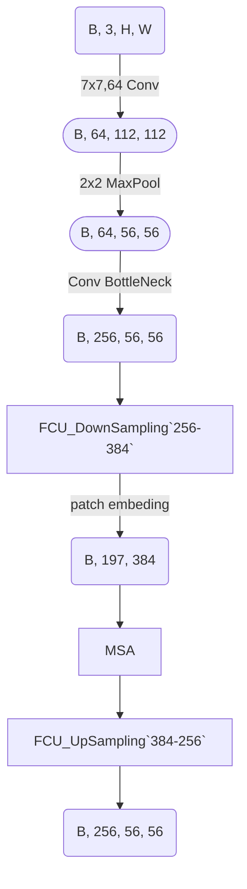
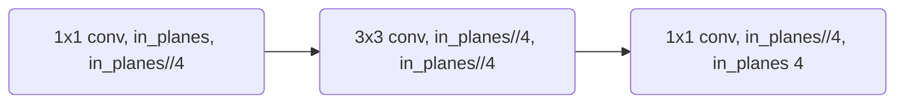

## Conformer
1. [Paper](https://arxiv.org/pdf/2105.03889.pdf)
2. Introduced by UCAS and Huawei and PengCheng lab
3. code: https://github.com/pengzhiliang/Conformer

## Paper Reading
### 1. Abstract
* CNN is good for capturing local features  whereas ViT is good for global features.
* Conformer -- combining the both frameworks and taking the advantage of them.
* FCU(feature coupling unit) -- the bridge connecting CNN and Transformers.

### 2. Strategy of Conformer
 - What is `loacl` features: local image neighborhoods.
 - What is `global` features: contour representations, shape descriptors, object topologies, et al.
 - How FCU worked: 
   - CNN -> [B, C, H, W]
   - Transformer -> [B, num_heads, num_pathches, embed_dim_per_head] / [B, num_patches, embed_dim]
   - FCU contains a 1x1 down-sampling(increasing dim) that align the `C` to `embed_dim`, then do the attention following with a 1x1 up-sampling back to the CNN spatial scale.
 - Positional embedding: for ViT, positional embedding is necessary for better performance because of its lacking of local connections, in Conformer, however, CNN provides local features and spatial location infomation by kernel moving and convolution, which also proved through benchworks.

### 3. Model architectures

`Repeat the upper stage and then do the global pooling and Linear classification`

### 4. Code details
 - According to the author, when implementing fcu down sampling,  `AvgPool2D` was used after `1x1 Conv` which was for the spatial size sampling. Herein, I think `F.interpolate` could replace the Pooling stage and achieve the same function. 
 - When applying fcu up sampling, firstly reshape the input shape [B, num_patches, embed_dim] to [B, embed_dim, H, W] and then do the `1 x 1 up Conv` for channels reflection and `F.interpolate` for spatital size reflection. 
 - In source code, `Med_ConvBlock`, which is similiar to the `ConvBlock` in the 1x1 conv --> 3x3 conv --> 1x1 conv  processing but with the same in_channels and out_channels, used for a down sampling. *It might not be necessary for the model.*

 - In `ConvTransBlock`, `last_fusion` is still a conv block that used for the conv features and transformers features fusion. Concertely speaking, in `Transformers block`, the forward function recived the cnn features and the former transfromers output features. So as the `ConvBlock`. Thus, after add the two part in `C` dimension, we need to do the conv again to fuse these features.
